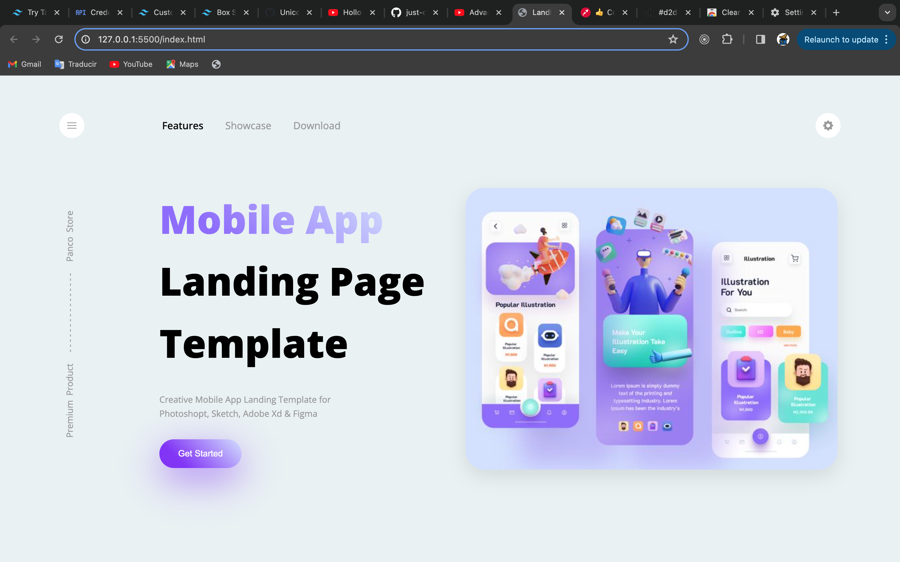

## 🧐 Just CSS Landing

> This is a page made with HTML and CSS (Vanilla), is a template for a fictional mobile product, is for educational purpuses.

## 🔧 Built With

- HTML
- CSS
- Flexbox

## 🔴 Live Demo

[Live Demo](https://just-css-landing.vercel.app/)

## 🛠 Getting Started

To get a local copy up and running follow these simple example steps.

- Go to the main page of te repo.
- Press the `Code` button and get the repo link.
- Clone it using git.
- Use the command `git clone <repo link>`

## ✒️ Authors

👤 **Cecilia Benitez**

- [@UnicornDad8](https://github.com/UnicornDad8)

## 🤝 Contributing

Contributions, issues and feature requests are welcome!

Feel free to check the [issues page](https://github.com/UnicornDad8/just-css-landing/issues).

## 📝 License

This project is [MOCKEND] licensed.
